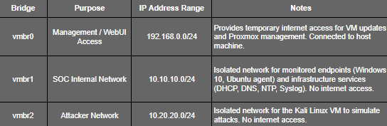
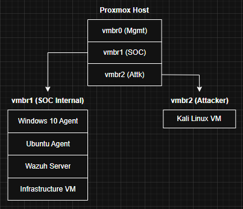

# **Network Topology**

## **Overview**

This document describes the network architecture of the Proxmox-based Wazuh SOC Home Lab. The lab is designed to simulate a realistic Security Operations Center environment with internal network segmentation for monitoring, controlled attacker simulation, and management access.

## **Network Interfaces and Virtual Bridges**

## **Traffic Flow**

**1. Management Traffic (vmbr0)**

* Temporary access to Proxmox web interface and VM internet updates.
* Removed after initial setup for security.

**2. SOC Internal Network (vmbr1)**

* Hosts infrastructure services and monitored endpoints.
* All telemetry (logs, DHCP events, DNS queries, NTP sync) flows to Wazuh Server.
* No direct internet connectivity, simulating a secure enterprise internal network.

**3. Attacker Network (vmbr2)**

* Dedicated network for attack simulations.
* Isolated from SOC internal network to avoid accidental contamination.
* Enables realistic attack detection and correlation in Wazuh.

## **Rationale for Network Segmentation**

* Security: Separating management, monitored, and attacker networks reduces risk and isolates potential lab misconfigurations.
* Observation: Clear segregation allows controlled testing and monitoring of attack scenarios.
* Realism: Enterprise SOCs often segregate networks by trust and function (internal, DMZ, attacker simulations).

## **IP Addressing Strategy**

* SOC internal VMs (Win10, Ubuntu agent) use DHCP provided by the infrastructure services VM.
* Infrastructure services VM and Wazuh Server use static IPs for stability and predictable log correlation.
* Attacker VM uses a static IP on the attacker network for controlled simulations.
* No external DHCP or DNS is used; the environment is fully self-contained.

## **Diagram (Logical View)**

## **Notes**

* No VM on vmbr1 or vmbr2 has internet access after initial updates.
* All communications relevant to SOC operations are contained within vmbr1.
* Attack traffic is confined to vmbr2 for safe simulation and analysis.
* Any temporary connectivity is strictly for OS and package updates and then removed to maintain lab isolation.
* This topology ensures safe, repeatable SOC simulations and accurate logging for Wazuh analysis.
