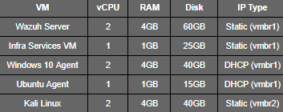

# **VM Design and Roles**

## **Overview**

This document describes the **purpose, design, and resource allocation** for each virtual machine in the Proxmox-based Wazuh SOC Home Lab. The goal is to illustrate **how each VM contributes to SOC functionality and attack simulation**.

## **1. Wazuh Server (Ubuntu)**

* **Role**: Central SIEM manager, log indexer, and dashboard provider.
* **Network Interfaces:**

 	**-** **vmbr0** (Management / temporary internet access)

 	**-** **vmbr1** (SOC internal network)

* **IP Strategy:** Static IP on vmbr1 for consistent log forwarding.
* **Resources:** 2 vCPU, 4GB RAM, 60GB disk.
* **Rationale:** Needs stability for log ingestion and dashboard services; static IP ensures agents reliably send logs.

## **2. Infrastructure Services VM (Ubuntu)**

* **Role:** Provides DHCP, DNS, NTP, and Syslog for SOC internal endpoints.
* **Network Interfaces:**

	**-** **vmbr0** (temporary internet for updates)

	**- vmbr1** (SOC internal network)

* **IP Strategy:** Static IP on vmbr1, DHCP and internal DNS serve endpoints.
* **Resources:** 1 vCPU, 1GB RAM, 25GB disk.
* **Rationale:** Centralized services improve lab realism; static IP ensures endpoints and Wazuh Server can always reach services.

## **3. Windows 10 Agent**

* **Role:** Monitored workstation; target for attack simulations.
* **Network Interfaces:**

&nbsp;	- **vmbr1** (SOC internal network)

&nbsp;	- Optional **vmbr2** for controlled attacker exposure if needed

* **IP Strategy**: DHCP from infra services VM
* **Resources:** 2 vCPU, 4GB RAM, 40GB disk.
* **Rationale:** Represents typical enterprise endpoint; dynamic IP demonstrates DHCP and log capture.

## **4. Ubuntu Agent**

* **Role:** Monitored Linux endpoint; sends logs to Wazuh Server.
* **Network Interfaces:** **vmbr1**
* **IP Strategy:** DHCP
* **Resources:** 1 vCPU, 1GB RAM, 15GB disk.
* **Rationale:** Allows Linux endpoint monitoring practice; shows multi-platform telemetry.
* 

## **5. Kali Linux VM**

* **Role:** Attacker VM for simulation of realistic attack scenarios.
* **Network Interfaces:** **vmbr2** (attacker network)
* **IP Strategy:** Static IP for controlled simulations
* **Resources:** 2 vCPU, 4GB RAM, 40GB disk
* **Rationale:** Isolated from SOC internal network; enables safe penetration testing and log generation without risking lab integrity.

## **VM Resource Allocation Summary**

## **Design Principles**

* **Isolation:** Attacker network (vmbr2) is fully separated from SOC internal network (vmbr1).
* **Service Availability:** Static IPs for Wazuh and infra VM ensure reliability.
* **Realism:** Each VM mimics enterprise SOC roles and responsibilities.
* **Efficiency:** Resources balanced to allow the lab to run smoothly on a single desktop host.

## **Security Considerations**

* Minimal OS installation on all Ubuntu VMs
* Infra VM only exposes required services to internal network
* Attack simulations contained to vmbr2
* Agents only communicate with Wazuh Server for telemetry

## **Conclusion**

This design ensures **functional SOC operations**, supports **realistic attack simulation**, and creates **clear documentation for training, evaluation, and demonstration purposes**.

