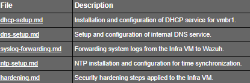

# **Infra Services VM Overview**

## **Purpose**

This folder documents the setup and configuration of the Infra Services VM, which provides core infrastructure services for the SOC lab. These services include:

* DHCP for SOC internal network (vmbr1)
* Internal DNS (*for future implementation*)
* Syslog forwarding to Wazuh (*for future implementation*)
* NTP for time synchronization

The Infra VM ensures a centralized, isolated, and controlled environment for all monitored endpoints.

## **Structure**

## **Usage**

This README serves as the entry point for anyone reviewing or replicating the SOC lab. Each **.md** file provides detailed, step-by-step instructions for its respective service while maintaining isolation, security, and SOC best practices.

By following these guides, the Infra VM can be deployed consistently to support monitoring, logging, and time-sensitive operations in the SOC lab.
