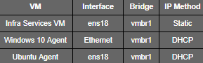

# **DHCP Service Setup (vmbr1 – SOC Internal Network)**

## **Purpose**

This document describes how DHCP was implemented for the SOC internal network (vmbr1) to centrally manage IP address assignment for monitored endpoints (Windows 10 and Ubuntu agents). The goal is to simplify host onboarding while keeping the environment controlled and predictable.

The DHCP service runs on a dedicated **Infra Services VM**, not on the Wazuh server, to maintain separation of concerns.


## **Design Decision**

* **Scope:** vmbr1 (10.10.10.0/24)
* **DHCP Server:** Infra Services VM (Ubuntu Server)
* **Clients:**

&nbsp;	- Windows 10 VM (Wazuh agent)

&nbsp;	- Ubuntu VM (Wazuh agent)

* **Excluded:** vmbr2 (attacker network – no DHCP by design)

This approach mirrors enterprise SOC environments where infrastructure services are centralized and security tooling remains isolated.


## **Network Interface Assumptions**




## **DHCP Server Installation**

On the Infra Services VM:

***sudo apt update***

***sudo apt install isc-dhcp-server -y***


## **Bind DHCP to vmbr1 Interface**

Edit the DHCP server defaults:

***sudo nano /etc/default/isc-dhcp-server***


Set:

**INTERFACESv4="ens18"**


This ensures DHCP only listens on the SOC internal network.


## **DHCP Scope Configuration**

Edit the main DHCP configuration file:


```bash

sudo nano /etc/dhcp/dhcpd.conf

```


Example configuration:

```conf

subnet 10.10.10.0 netmask 255.255.255.0 {

&nbsp; range 10.10.10.100 10.10.10.200;

&nbsp; option routers 10.10.10.1;

&nbsp; option domain-name-servers 10.10.10.10;

&nbsp; default-lease-time 600;

&nbsp; max-lease-time 7200;

}

```

Adjust gateway and DNS values based on your lab design.


## **Enable and Start DHCP Service**

```bash

sudo systemctl enable isc-dhcp-server

sudo systemctl restart isc-dhcp-server

```


Verify status:

```bash

systemctl status isc-dhcp-server

```


## **Client Verification**

### **Windows 10 VM**

```cmd

ipconfig /release

ipconfig /renew

ipconfig

```


Confirm the IP falls within the defined DHCP range.


### **Ubuntu Agent VM**

```bash

ip a show ens18

```


Expected output includes:

```

scope global dynamic ens18

```


## **Persistence Consideration (Important)**

Cloud-init was disabled on DHCP clients to prevent Netplan configurations from reverting to static IPs after reboot. This ensures DHCP behavior remains consistent across restarts.


## **Security Notes**

* DHCP is restricted to vmbr1 only
* No DHCP is provided on vmbr2 to preserve attacker isolation
* Lease ranges are limited to prevent rogue host exhaustion


## **Outcome**

With DHCP in place, SOC endpoints can be added or rebuilt without manual IP configuration, while maintaining full visibility through Wazuh.


