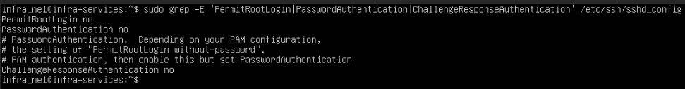
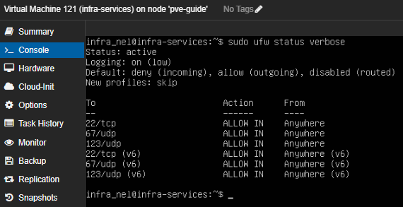
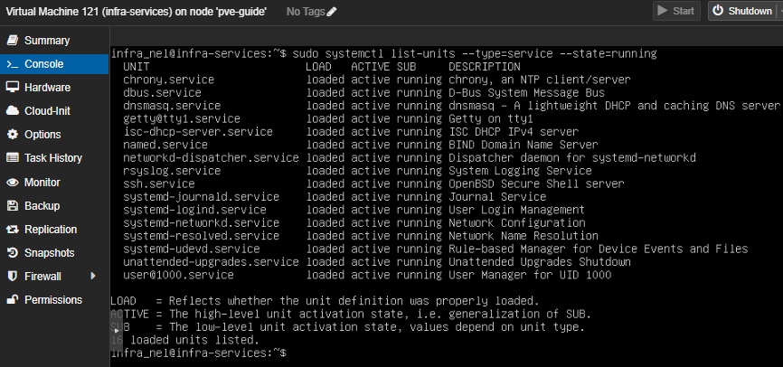

# **Infra Services VM Hardening**

## **Purpose**

This document outlines the security hardening measures applied to the Infra Services VM in the SOC lab. Currently, the VM runs \*\*DHCP and NTP services\*\*, and hardening ensures these critical services are protected from unauthorized access and misconfigurations.

## **Hardening Steps Applied**

1. **SSH Security**

* Disable root login via SSH.
* Enforce key-based authentication.

2\. **Firewall (UFW)**

* Enable UFW.
* Allow only required ports:

 	- DHCP: 67/UDP

 	- NTP: 123/UDP

3\. **Service Hardening**

* Disable unnecessary services.
* Ensure only DHCP and NTP are running. 

4\. **System Updates**

* Keep the OS and packages up to date.
* Configure unattended security updates if suitable.

5\. User and Permissions

* Remove default or unused accounts.
* Assign minimal privileges needed for service operation.

6\. **Log Monitoring**

* Ensure local logs are collected and forwarded to Wazuh.
* Monitor authentication attempts and service failures.

## **Outcome**

After applying these steps, the Infra Services VM is secured according to SOC best practices for the services currently implemented (DHCP and NTP), while remaining fully functional within the isolated lab environment.

