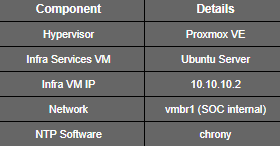

# **NTP Setup – Infrastructure Services VM**

## **Overview**

This document covers the setup of an **internal NTP (Network Time Protocol) service** for the SOC home lab.

The NTP service is hosted on the **Infrastructure Services VM** and provides time synchronization for SOC-related virtual machines.

Consistent system time is essential for **accurate log correlation, alert analysis, and incident timeline reconstruction** in Wazuh.


## **Lab Environment**




## **Purpose**

The NTP service is implemented to:

* Maintain consistent timestamps across SOC systems
* Reduce time drift between endpoints and the SIEM
* Support accurate Wazuh alert timelines
* Simulate real-world SOC infrastructure design


## **STEP 1: Install NTP Service (Chrony)**

**On the Infrastructure Services VM:**

```bash

sudo apt update

sudo apt install chrony -y

```

**Verify the service status:**

```bash

systemctl status chrony

```


## **STEP 2: Configure Chrony**

**Edit the chrony configuration file:**

```bash

sudo nano /etc/chrony/chrony.conf

```


**Apply the following configuration:**

```bash

pool pool.ntp.org iburst

allow 10.10.10.0/24

local stratum 10

logdir /var/log/chrony

```

### **Configuration Summary**

* Uses public NTP servers as upstream sources
* Allows only the SOC internal subnet
* Continues serving time if upstream is unavailable
* Enables logging for troubleshooting


## **STEP 3: Restart and Enable the Service**

```bash

sudo systemctl restart chrony

sudo systemctl enable chrony

```


**Verify NTP sources:**

```bash

chronyc sources

```


## **STEP 4: Configure Linux Clients**

**Applies to:**

* Wazuh Server VM
* Ubuntu Linux Agent VM


**Install chrony if needed:**

```bash

sudo apt install chrony -y

```

**Edit the configuration:**

```bash

sudo nano /etc/chrony/chrony.conf

```

**Set the Infra VM as the NTP server:**

```bash

server 10.10.10.2 iburst

```

**Restart the service:**

```bash

sudo systemctl restart chrony

```

**Verify synchronization:**

```bash

chronyc tracking

```


## **STEP 5: Configure Windows 10 Client (Optional)**

**Open PowerShell as Administrator on the Windows VM:**

```powershell

w32tm /config /manualpeerlist:10.10.10.2 /syncfromflags:manual /update

net stop w32time

net start w32time

w32tm /resync

```


**Verify status:**

```powershell

w32tm /query /status

```


### **Timezone Notes**

* NTP synchronizes system time (UTC)
* Timezone settings are configured per VM
* All SOC VMs should use the same timezone for consistency

This approach follows SOC best practices.


## **Validation**

Linux:

```bash

timedatectl

```


Windows:

```powershell

Get-Date

```


All systems should display closely aligned timestamps.


## **Security Considerations**

* NTP access is restricted to the internal SOC network
* No external NTP queries are allowed from clients
* Centralized time management improves log integrity
