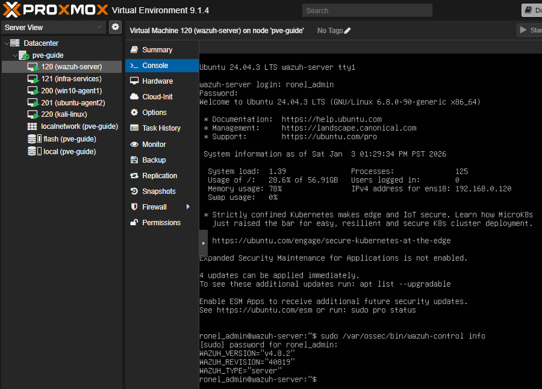
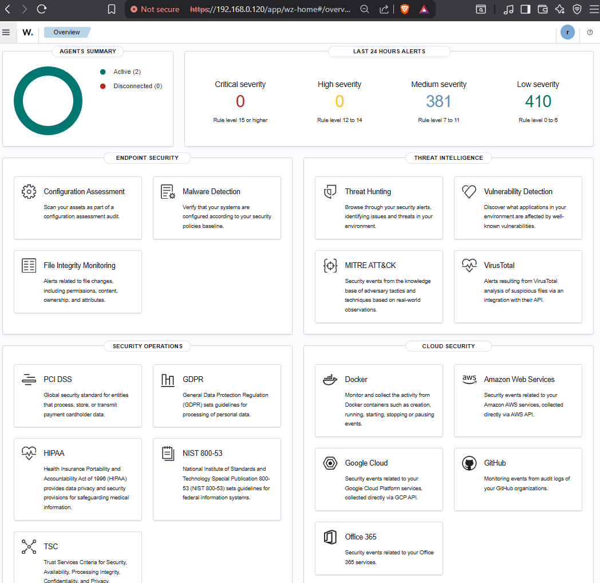

# Wazuh Server Setup

## Purpose

This document covers the deployment and initial configuration of the **Wazuh Server** in the SOC home
lab environment. 

The Wazuh Server acts as the **central SIEM and security management platform**, responsible for receiving, analyzing, and visualizing security events from monitored endpoints.

This setup is designed for **learning SOC fundamentals**, endpoint monitoring, and attack simulation using a controlled lab environment.

## Base OS

* Ubuntu Server LTS
* Minimal installation

## Wazuh Installation

The Wazuh Server was installed using the official Wazuh installation script, which deploys:
* Wazuh Manager
* Wazuh Indexer
* Wazuh Dashboard
#### Installation method: [Official Wazuh installation script (all-in-one deployment)](https://documentation.wazuh.com/current/quickstart.html)

## Network Interfaces

The Wazuh Server uses **two network interfaces** to separate access and monitoring traffic.
* NIC 1 (vmbr0): Management & Web UI access from host
* NIC 2 (vmbr1): SOC internal network (agents)

## Post-Installation Validation

* Dashboard accessible from Windows host
* Wazuh services running
* Indexer health verified

The image below shows the Wazuh WebUI after the installation and setup on the Wazuh Server VM and installing Wazuh agents on both Windows 10 VM and Ubuntu VM.

