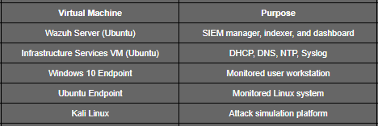
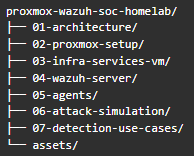

# **Proxmox-Based Wazuh SOC Home Lab**

## **Overview**

This project documents a **self-built Security Operations Center (SOC) home lab** deployed on **Proxmox VE** centered around **Wazuh SIEM**. The lab is designed to mirror how monitoring, detection, and supporting infrastructure are implemented in real enterprise environments—not just to make tools work, but to understand *why* they are deployed the way they are.

Rather than relying on pre-packaged appliances, each component is intentionally designed, deployed, and documented to demonstrate foundational blue team and SOC engineering skills.

## **Project Phases**

This lab is intentionally developed and documented in phases to mirror how SOC platforms are built and validated in real environments.

### **Phase 1 – SOC Infrastructure & Monitoring Foundation (Completed)**
- Proxmox-based virtualization and network segmentation
- Wazuh server deployment (manager, indexer, dashboard)
- Windows and Linux endpoint deployment
- Log collection, agent communication, and baseline visibility
- Architecture design decisions and documentation

### **Phase 2 – Attack Simulation & Detection Engineering (In Progress / Planned)**
- Controlled attack simulations against lab endpoints
- Validation of Wazuh detection rules and alerts
- Mapping detections to MITRE ATT&CK techniques
- Alert analysis, triage, and investigation workflows
- Detection gaps, tuning, and lessons learned

## **Goals of This Lab**

* Build a realistic SOC environment using open-source tools
* Understand infrastructure dependencies behind a SIEM deployment
* Simulate attacker activity and observe detections (Phase 2)
* Practice log analysis, alert triage, and investigation workflows
* Document decisions, trade-offs, and limitations clearly

This repository is meant to reflect **how a junior SOC analyst or blue team engineer thinks**, not just what commands they can run.

## **Lab Environment Summary**

The lab runs on a **dedicated Proxmox host** with multiple isolated virtual networks:

* **vmbr0** – Management / temporary internet access
* **vmbr1** – SOC internal network (monitored environment)
* **vmbr2** – Attacker network (isolated)

#### **Virtual Machines**

Each VM is documented with its role, configuration, and security considerations.

## **What This Lab Demonstrates**

This project is focused on **fundamentals**:

* Network segmentation and traffic control
* Centralized logging and time synchronization
* Endpoint monitoring with agents
* Detection of common attack techniques
* Understanding how infrastructure logs support investigations

The intent is to build a solid base that can later be expanded into:

* Detection engineering
* Threat hunting
* Automation
* Purple team exercises

## **Repository Structure**

## **Why Proxmox + Wazuh**

* **Proxmox** provides flexibility, visibility, and realistic network segmentation
* **Wazuh** offers endpoint visibility, log analysis, and detection without vendor lock-in

## **Assumptions**

* This lab is built for learning and demonstration purposes
* High availability and redundancy are out of scope
* Security controls are intentionally balanced with observability

These assumptions are documented openly rather than hidden.

## **Who This Is For**

* Aspiring SOC analysts
* Blue team learners
* IT professionals transitioning into cybersecurity
* Anyone wanting hands-on SIEM experience beyond theory

## **How to Use This Repository**

* Start with **01-architecture** to understand design decisions
* Follow the setup sections to reproduce the lab
* Review attack simulations and detections to understand SOC workflows
* Use the documentation as a reference during learning reviews

## **Disclaimer**

This lab is for **educational purposes only**. Attack simulations are conducted in an isolated environment against systems owned and controlled by the author.

## **Author**

Built and documented as part of a personal cybersecurity learning journey, with a focus on practical SOC and blue team skills.

> Note: This repository reflects an incremental SOC build. Phase 1 focuses on infrastructure and visibility; detection engineering and attack simulation are documented in Phase 2.

