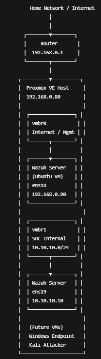

# **Proxmox-Based Wazuh SOC Home Lab**

### 

### Project Overview

This project documents the design and implementation of a Proxmox-based SOC Home Lab using Wazuh SIEM/XDR. The lab simulates a small enterprise environment with monitored endpoints, an attacker machine, and proper network segmentation. It is intended for cybersecurity learners and aspiring SOC analysts to demonstrate hands-on skills in monitoring, detection, and incident analysis.

This project includes:

* SIEM deployment and configuration
* Endpoint monitoring (Windows \& Linux)
* Network segmentation and isolation
* Attack simulation and alert analysis

### Objectives

* Deploy Wazuh Server on Proxmox
* Monitor Windows and Linux endpoints using Wazuh agents
* Simulate attacks using Kali Linux
* Analyze alerts, logs, and security events
* Apply SOC analyst workflows (detect → analyze → respond)
